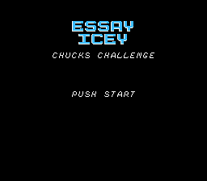
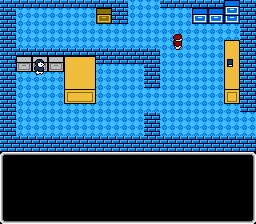

In this game, you play as Chuck, a worker at the Essay Icey
(should be "Icy" - a misspelling set in stone, argh!) company. Your
goal is to accomplish the tasks given to you by your boss, John, until he
has nothing left to give you. This is accomplished by picking up items
around the building and asking your coworkers for hints. Move with the 
directional pad and talk to people or pick up items with the A button.

The code is written in 6502 assembly and was compiled with the 
[Ophis](https://github.com/michaelcmartin/Ophis) assembler. The
main loop is in [chucks_prg.p65](./chucks_prg.p65). It runs best on
[FCEU](http://www.fceux.com/web/home.html) (or it did when I developed it), 
as this was used for testing. It runs on the actual NES hardware, as well, 
but with some added choppiness in the music due to how the graphics updates
were (mis)handled. A cycle-accurate emulator such as 
[Nestopia](http://nestopia.sourceforge.net/) will
reproduce this choppiness.

**Screenshots:**

